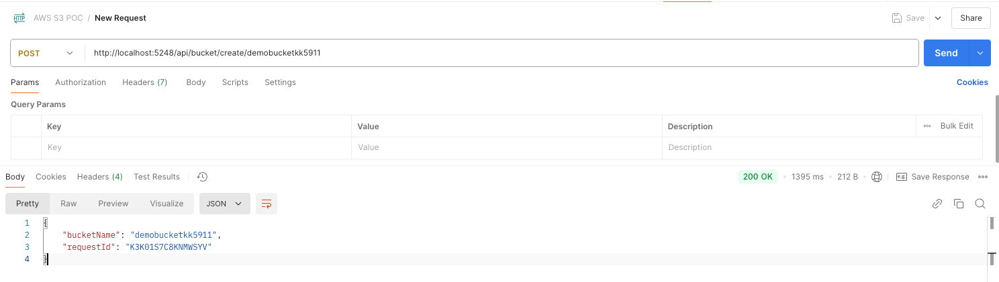
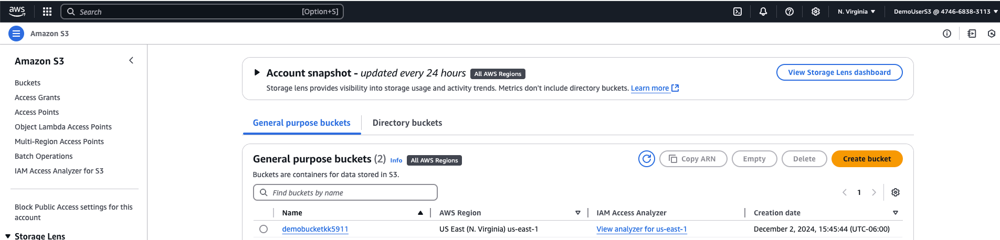
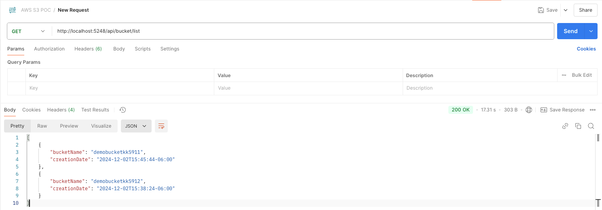
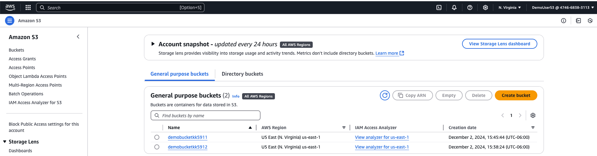
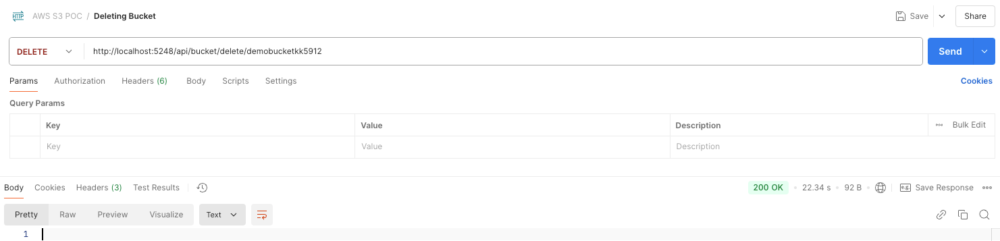
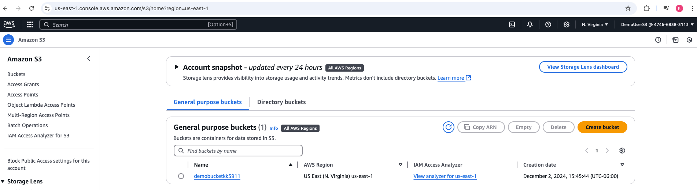

**DotNetBucketry**

This is a Sample AWS S3 Repo for s3 operations.

**S3 UseCases:-**

Backup and Storage, Application Hosting, Media Hosting, Software Delivery.

**Dependencies:-**

1. .Net Core Runtime
2. .Net Core SDK
3. AWS SDK S3 (Provides you with .net APIS for S3)
4. AWS SDK Extensions Netcore Setup ( this package allows to integrate with .net core configuration and dependency injection frameworks to load aws credentials into .net core client)
5. AWS CLI

**IAM ROLE**

1. Create a User in AWS Console with Programmatic Access and attach the permissions by selecting Permissions tab and select AmazonS3FullAccess Policy. 
2. Download the Access Key and Secret Key.
3. Configure the AWS CLI with the Access Key and Secret Key.

Bucket Operations:
1. **Create Bucket**:-
   ```aws s3api create-bucket --bucket my-bucket-name --region us-west-2```
   
    Check if the bucket exists or not by using '**DoesS3BucketExistAsync**' method in aws sdk provided.
   
    If bucket exists throw the message '**Bucket already exists**'.
   
    If not exists, create the bucket with the name provided using the '**PutBucketAsync**' method in aws sdk.
    
   
   
   AWS Console Quick Check:-

   
    

2. **List Buckets** :- 
   
    List all the buckets in the account using the '**ListBucketsAsync**' method in aws sdk.
    
    

   AWS Console Quick Check:-
   
   

3. **Delete Bucket**:- 
   
    Delete the bucket using the '**DeleteBucketAsync**' method in aws sdk.
    
    
    
    AWS Console Quick Check:-
    
    