**DotNetBucketry**

This is a Sample AWS S3 Repo for s3 operations. (This is done based on the clean architecture from ardalis. https://github.com/ardalis/CleanArchitecture)

**S3 UseCases:-**

Backup and Storage, Application Hosting, Media Hosting, Software Delivery.

**Dependencies:-**

1. .Net Core Runtime
2. .Net Core SDK
3. AWS SDK S3 (Provides you with .net APIS for S3)
4. AWS SDK Extensions Netcore Setup ( this package allows to integrate with .net core configuration and dependency injection frameworks to load aws credentials into .net core client)
5. AWS CLI

**IAM ROLE**

1. Create a User in AWS Console with Programmatic Access and attach the permissions by selecting Permissions tab and select AmazonS3FullAccess Policy. 
2. Download the Access Key and Secret Key.
3. Configure the AWS CLI with the Access Key and Secret Key.

**Bucket Operations:**
1. **Create Bucket**:-
      
    Check if the bucket exists or not by using '**DoesS3BucketExistAsync**' method in aws sdk provided.
   
    If bucket exists throw the message '**Bucket already exists**'.
   
    If not exists, create the bucket with the name provided using the '**PutBucketAsync**' method in aws sdk.
    
   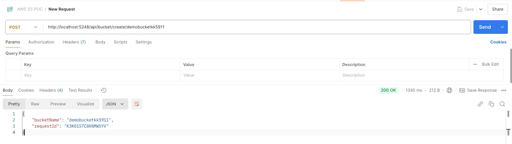
   
   AWS Console Quick Check:-

   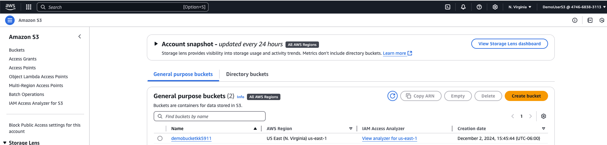
    

2. **List Buckets** :- 
   
    List all the buckets in the account using the '**ListBucketsAsync**' method in aws sdk.
    
    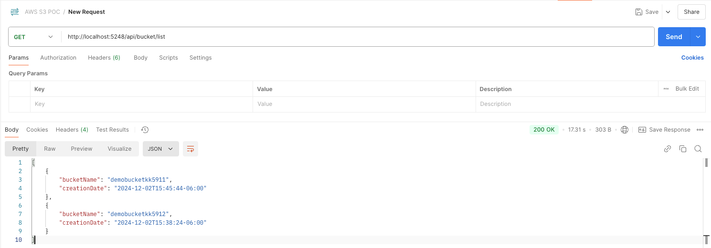

   AWS Console Quick Check:-
   
   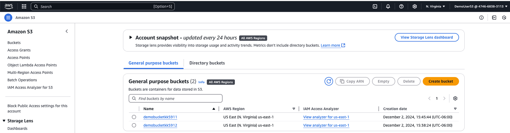

3. **Delete Bucket**:- 
   
    Delete the bucket using the '**DeleteBucketAsync**' method in aws sdk.
    
    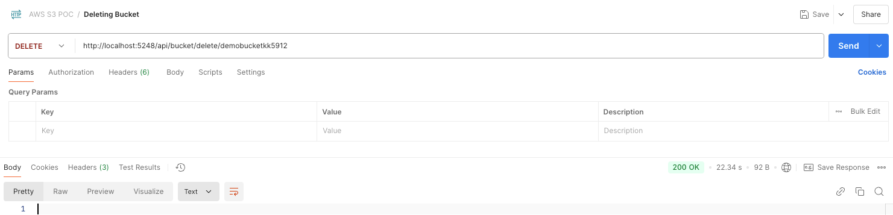
    
    AWS Console Quick Check:-
    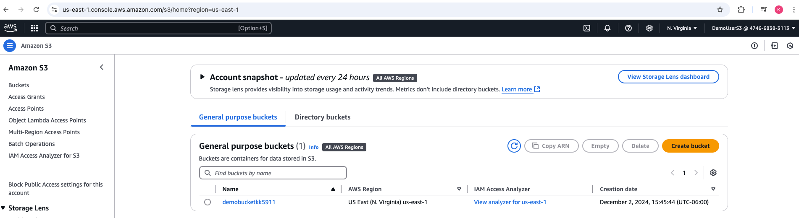

4. **Upload File**:-
    
    Upload the file to the bucket using transfer utility UploadAsync Method provided by the aws sdk.
    
    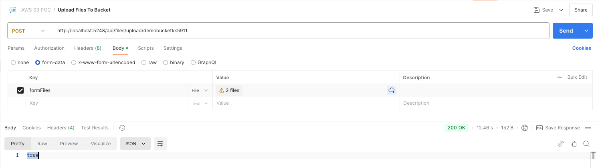
    
    AWS Console Quick Check:-
    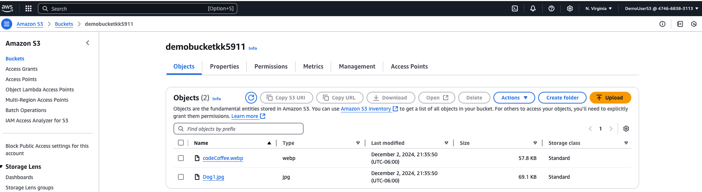

5. **Uploading Files and Generating Pre-Signed URLS:-**
    
    **Pre-Signed URL**:- A pre-signed URL gives you access to the object identified in the URL, provided that the creator of the pre-signed URL has permissions to access that object.
    
    **UseCase**:- Share the pre-signed URL with the user to download the file.
    
    **Steps**:- 
    
    1. Create a pre-signed URL using the '**GetPreSignedURL**' method in aws sdk.
    2. Share the URL with the user.
    
    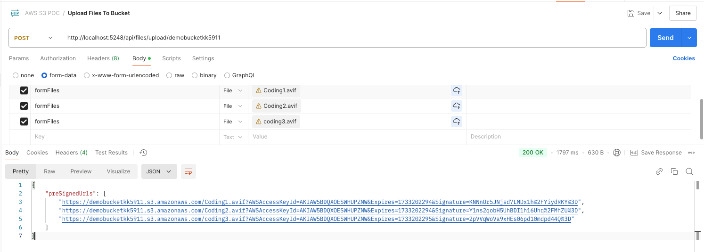
   
    Clicking on each of the Pre-signed URL will generate the get request of the file and then click send to see the file that's uploaded.
    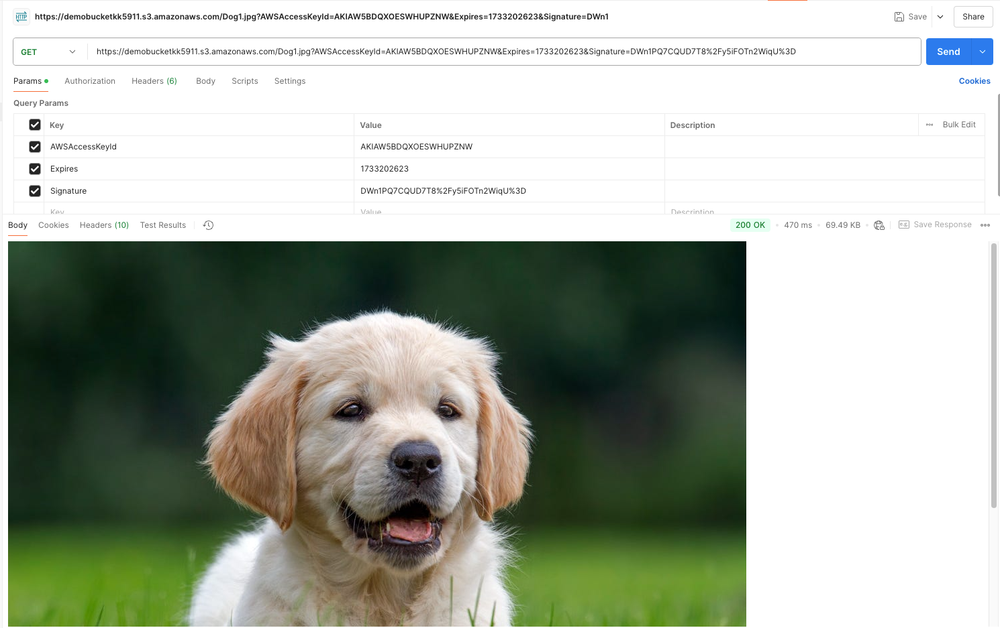
    
    AWS Console Quick Check:-
    
    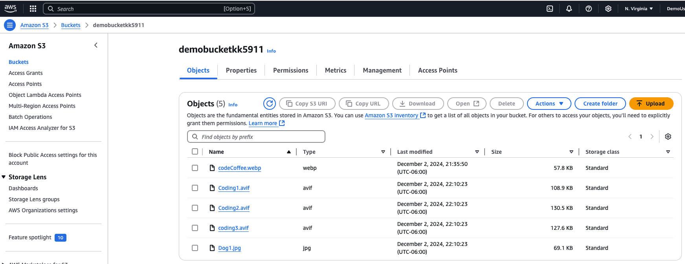

6. **Get All files in the bucket:-**
    
    Get all the files in the bucket using the '**ListObjectsAsync**' method in aws sdk.
    
    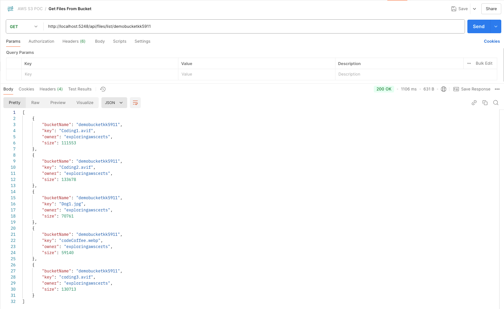

7. **Download File from the bucket:-**
    
    Download the file from the bucket using the '**DownloadAsync**' method in aws sdk.

    Here in my case, i'm using mac and i have folder named 'DownloadedFiles' in my Desktop.
    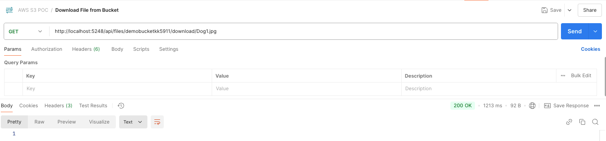
   
    Desktop File Check:-
     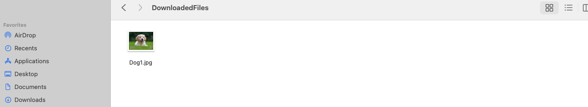

8. **Delete File from the bucket:-**
        
     Delete the file from the bucket using the '**DeleteObjectsAsync**' method in aws sdk.
     

   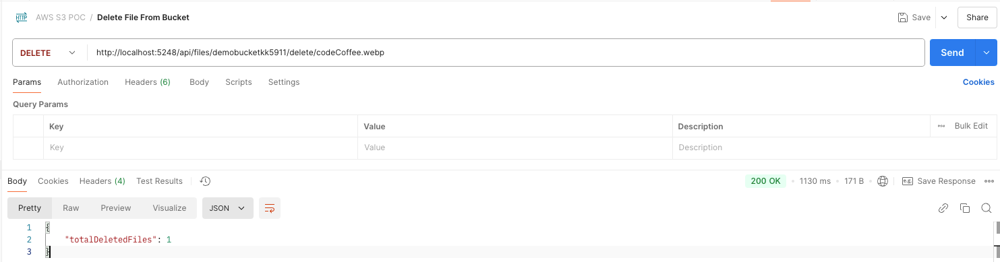   

   **BEFORE DELETING:-**
   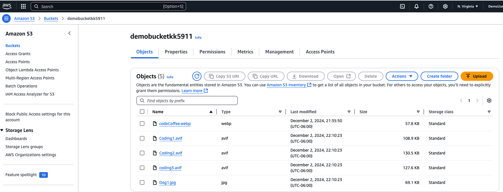
     
   AWS Console Quick Check:-
   
   **After Deletion:-**

   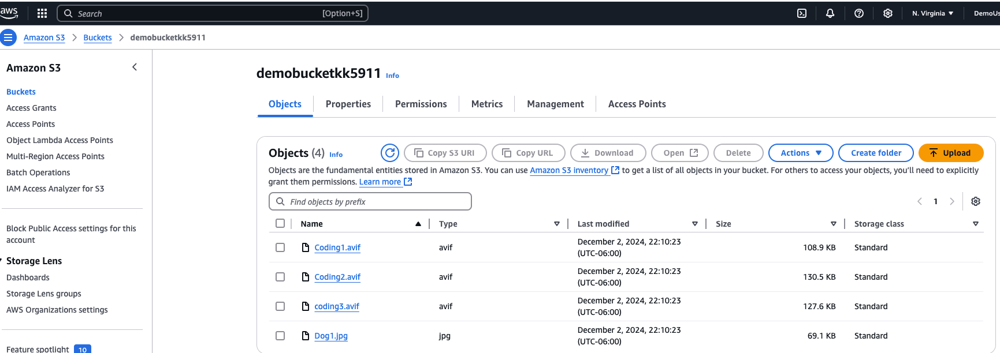
   
